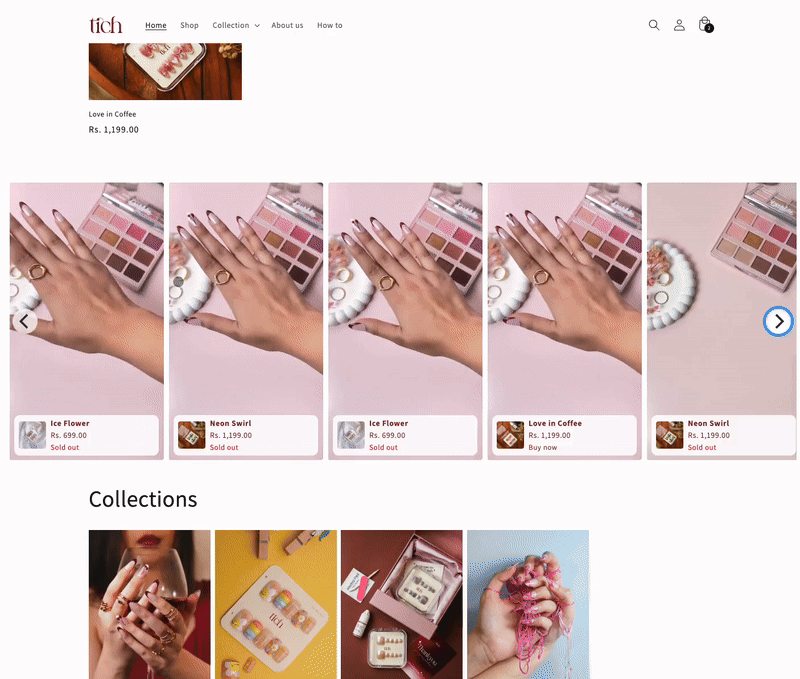

# Shopify Reels Shoppable Slider 🎞️🛒  
Swipe-to-shop Reels video slider for **any** Online-Store 2.0 theme – pure Liquid, zero recurring fees.



---

## ✨ Features
|                    | Details |
|--------------------|---------|
| **Autoplay Reels / TikToks** | Vertical MP4/WebM, muted + loop, mobile-ready. |
| **Instant shoppability** | Card overlay links to the product page (toggle to “Add-to-Cart” in one line). |
| **Theme-agnostic** | Dawn 12, Refresh 5, Impulse 7, Broadcast 4 tested (May 2025). |
| **Tiny footprint** | 1 Liquid section (≈5 KB) + Flickity (29 KB gzipped). No app JS bloat. |
| **SEO friendly**  | Poster image ensures stable LCP; JSON-LD ready field for future enhancement. |
| **MIT license**   | Free to use, fork, or extend in commercial projects. |

---

## 🚀 Installation (3 min)

1. **Download** `sections/reels-slider.liquid` from this repo.  
2. Shopify Admin → **Online Store › Themes › … › Edit code**.  
   * Open **Sections** → **Add new section** → paste → **Save**.  
3. In **Layout › theme.liquid** (or `theme.liquid` alternative) **before** `</head>` add:

   ```liquid
   {{ 'https://cdn.jsdelivr.net/npm/flickity@2/dist/flickity.min.css' | stylesheet_tag }}
   {{ 'https://cdn.jsdelivr.net/npm/flickity@2/dist/flickity.pkgd.min.js' | script_tag }}
### Theme Editor steps

1. **Add section ▸ Reels slider**  
   1. Upload each **MP4/WebM** (Settings ▸ Files).  
   2. Pick a **Poster image** (same **9 : 16** aspect) for LCP.  
   3. Select the **Related product**.  
2. **Save** → preview on mobile & desktop. Swipe to test 🎉

---

### ⚙️ Customization

| Need | How to do it |
|------|--------------|
| **Brand colours & fonts** | Edit `color:#7B2B26` (maroon) and the `font-size` lines in the `<style>` block. |
| **Corner-radius / gap size** | Tweak `border-radius: 20px;` and the `--reels-gap-m / --reels-gap-d` CSS variables. |
| **“Add to Cart” instead of PDP link** | Replace the `<a>` wrapper with a `<button data-variant-id="…">`, then re-enable the **/cart/add.js** listener (see [`docs/customization.md`](docs/customization.md)). |
| **Multiple products per Reel** | Add `product_2`, `product_3` settings or switch to product blocks (full guide in [`docs/customization.md`](docs/customization.md)). |

---

### 🛠️ Troubleshooting

| Symptom | Fix |
|---------|-----|
| **Card text turns blue/purple** | Ensure `a.reels-card { color:#YourBrand !important }` rule is *below* theme CSS. |
| **Flickity not found** | Confirm both CDN tags in Step 3 and that no duplicate versions load. |
| **Video won’t autoplay on iOS** | File must be **muted**, ≤ 6 MB, MP4/H.264. |
| **White flash between slides** | Use identical **9 : 16** export dimensions *and* supply a poster image. |

For more fixes, see [`docs/troubleshooting.md`](docs/troubleshooting.md).

---

### 🗺️ Roadmap
* IG / TikTok Graph-API auto-import  
* Pure-CSS scroll fallback (no JS)  
* JSON-LD **VideoObject** injection for SEO  

PRs & issues welcome!

---

### 🤝 Contributing

1. **Fork** → create a feature branch → commit clear messages.  
2. **Open a PR** against **main** (template provided).  
3. Ensure `npm run test:theme-check` passes (GitHub CI runs Shopify Theme Check).
